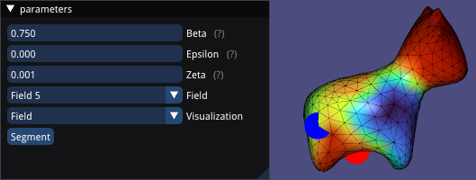

# mesh-segmentation-caf

This repository contains C++ implementation of the 3D mesh segmentation based on paper [Au et al, 2012].



## Getting Started

### Dependencies
In windows, I've installed & tested all the dependencies listed below with vcpkg. And it works very well.

- Viewer : libigl, GLEW, GLFW3
- Linear Algebra : SuiteSparse, Eigen3
- Mesh Util : CGAL

### Build
```
git clone https://github.com/ranahanocka/mesh-segmentation-caf.git
cd mesh-segmentation-caf
mkdir build
cd build
cmake .. # -DCMAKE_TOOLCHAIN_FILE=<path_to_toolchain_file>
```

## To Do
- [ ] Calculate isolines
- [ ] Final cut selection
- [ ] Draw isolines


## References
[Au et al, 2012] Au, Oscar Kin-Chung, et al. "Mesh segmentation with concavity-aware fields." IEEE Transactions on Visualization and Computer Graphics 18.7 (2011): 1125-1134.
